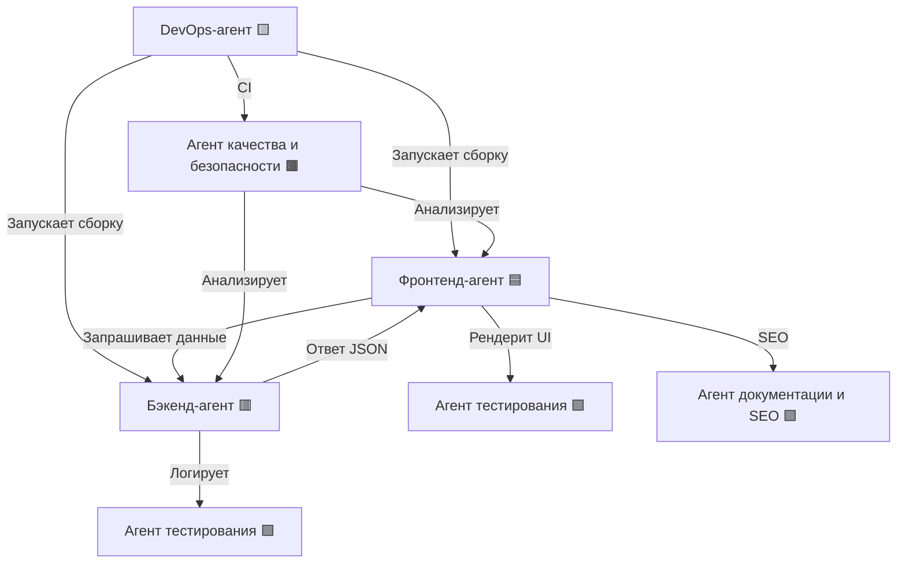

# 📘 Документация по агентам проекта `newFrontLanding`

## 🔰 Общее описание

Этот документ описывает программных агентов, участвующих в разработке проекта [newFrontLanding](https://github.com/AntonioPanuchi/newFrontLanding). Каждый агент выполняет специализированные задачи в рамках архитектуры проекта. Документация служит живым контекстом и будет дополняться по мере развития системы.

---

## 🧩 Шаблон для добавления новых агентов

```markdown
## 🧠 Агент <Название> <Метка>

**Роль:**
<Краткое описание роли>

**Входные данные:**
- <Тип или формат входа>

**Выходные данные:**
- <Результат или эффект работы агента>

**Основные действия:**
- <Ключевые действия или функции>

**Инструменты:**
- <Технологии, библиотеки, утилиты>

**Зависимости:**
- <От кого зависит или кого использует>

**Примеры взаимодействия:**
- <Конкретные ситуации и сценарии>

**Связанные файлы:**
- <Путь до файлов в проекте>

**Контрольные точки:**
- <KPI, метрики эффективности>
```

> 📌 Используйте этот шаблон при добавлении новых агентов в систему. Просто скопируйте и заполните поля ниже соответствующего раздела.

---

## 🗺️ Визуализация взаимодействия агентов



### 🎨 Обозначения ролей:

- 🟦 Фронтенд
- 🟥 Бэкенд
- 🟨 DevOps / CI/CD
- 🟪 Тестирование
- 🟫 Качество и безопасность
- 🟩 Документация и SEO

---

## 📂 Связанные директории и файлы

- `frontend/src/components/`
- `frontend/src/routes/`
- `backend/routes/`, `backend/services/`
- `.github/workflows/`
- `scripts/deploy.sh`
- `docs/`, `README.md`, `SEO_SUMMARY.md`

---

## 🕒 История изменений

- `2025-07-15`: Добавлены примеры JSON и взаимодействия
- `2025-07-16`: Вставлена диаграмма взаимодействия `mermaid`
- `2025-07-17`: Добавлены метки, список файлов и шаблон
- `2025-07-18`: Выполнена финальная редактура и структуризация документа

---

## 📦 Фронтенд-агент 🟦

**Роль:**
Разработка пользовательского интерфейса, отрисовка компонентов и взаимодействие с API.

**Входные данные:**
- JSON от API `/api/server-statuses`
- UI/UX-требования

**Выходные данные:**
- JSX-компоненты, HTML-структура, стили
- SEO-метаданные через PageHead

**Основные действия:**
- Реализация компонентов
- Получение данных от API
- Интеграция с роутингом, темами, состояниями

**Инструменты:**
React, Vite, TailwindCSS, React Router, HelmetProvider, Storybook

**Зависимости:**
- Бэкенд-агент (для данных)
- Агент документации и SEO (для метаданных)

**Примеры взаимодействия:**
- Обновление `<ServerCard />` после изменения API
- Отображение новых серверов на домашней странице

**Связанные файлы:**
- `frontend/src/components/ServerCard.tsx`
- `frontend/src/routes/Home.tsx`

**Контрольные точки:**
- Время отрисовки < 100ms
- Storybook покрытие компонентов ≥ 90%

---

## ⚙️ Бэкенд-агент 🟥

**Роль:**
Обработка запросов, предоставление данных для UI, мониторинг состояния серверов.

**Входные данные:**
- HTTP-запросы (например, GET `/api/server-statuses`)

**Выходные данные:**
- JSON-ответы со статусами серверов
- Логи в Winston

**Основные действия:**
- Пинг серверов
- Кеширование и выдача статусов
- Обработка ошибок

**Инструменты:**
Node.js, Express, Winston, Ping, node-fetch

**Зависимости:**
- Фронтенд-агент (использует данные)
- Агент тестирования (валидирует логику)

**Примеры взаимодействия:**
- Возвращает список серверов по API
- Логирует сбои соединения

**Связанные файлы:**
- `backend/routes/status.js`
- `backend/services/pingService.js`

**Контрольные точки:**
- API отклик < 300мс
- Аптайм API ≥ 99.9%

---

## 🚀 DevOps-агент 🟨

**Роль:**
Автоматизация процессов сборки, тестирования и деплоя проекта.

**Входные данные:**
- Git push, Pull Request

**Выходные данные:**
- CI-отчёты, билд-артефакты
- Деплой на сервер

**Основные действия:**
- Настройка workflow
- Выполнение shell-скриптов деплоя

**Инструменты:**
GitHub Actions, Appleboy SSH, PM2, deploy.sh

**Зависимости:**
- Все агенты (участвуют в пайплайне)

**Примеры взаимодействия:**
- Деплой фронта и бэка на push в `main`

**Связанные файлы:**
- `.github/workflows/ci.yml`
- `scripts/deploy.sh`

**Контрольные точки:**
- Успешные билды ≥ 95%
- Время деплоя < 60 секунд

---

## 🧪 Агент тестирования 🟪

**Роль:**
Проверка корректности функционала с помощью автотестов.

**Входные данные:**
- Исходный код
- JSON от API

**Выходные данные:**
- Отчёты об успешности или сбоях тестов

**Основные действия:**
- Запуск unit и интеграционных тестов
- Проверка бизнес-логики

**Инструменты:**
Node.js, assert, собственные скрипты

**Зависимости:**
- Бэкенд и фронтенд агенты

**Примеры взаимодействия:**
- Запуск `test-fetch.js` после обновления API

**Связанные файлы:**
- `backend/test/test-fetch.js`

**Контрольные точки:**
- Покрытие кода ≥ 80%
- Отчёты без ошибок в CI

---

## 🔍 Агент качества и безопасности 🟫

**Роль:**
Обеспечение читаемости, безопасности и совместимости кода.

**Входные данные:**
- Исходный код

**Выходные данные:**
- Отчёты линтинга и аудита

**Основные действия:**
- ESLint, Prettier, npm audit
- Исправление проблем

**Инструменты:**
ESLint, Prettier, npm audit

**Зависимости:**
- DevOps-агент (для CI)

**Примеры взаимодействия:**
- CI отклоняет PR с ошибками линтера

**Связанные файлы:**
- `.eslintrc`, `.prettierrc`

**Контрольные точки:**
- Ошибки линтера = 0
- Актуальность зависимостей ≥ 95%

---

## 📘 Агент документации и SEO 🟩

**Роль:**
Ведение технической и SEO-документации, генерация метатегов.

**Входные данные:**
- Контент страниц, заголовки, изображения

**Выходные данные:**
- Markdown-документация, SEO-теги

**Основные действия:**
- Обновление README, SEO_SUMMARY
- Создание `<PageHead />`

**Инструменты:**
Markdown, Helmet, Storybook

**Зависимости:**
- Фронтенд-агент (использует SEO-компоненты)

**Примеры взаимодействия:**
- Настройка метатегов при добавлении новой страницы

**Связанные файлы:**
- `frontend/src/components/PageHead.tsx`
- `docs/SEO_SUMMARY.md`

**Контрольные точки:**
- Lighthouse SEO ≥ 90
- Полное описание всех маршрутов

---

> 🧠 *Документ является живым. Новые агенты и изменения добавляются по мере развития проекта.*
